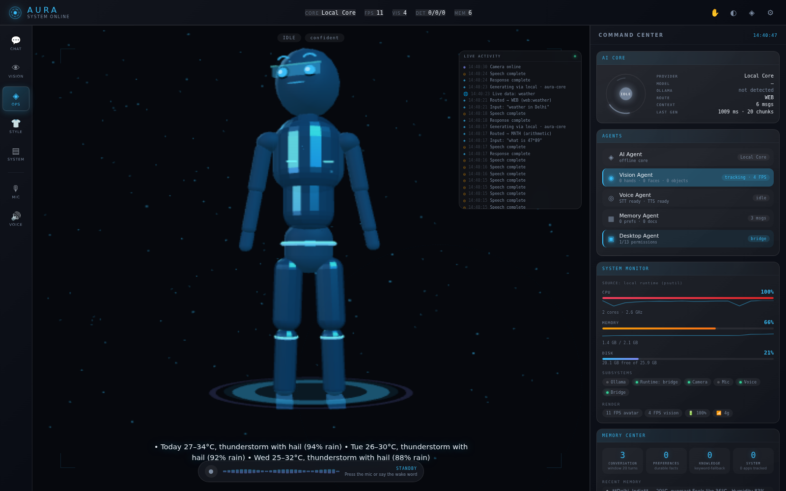
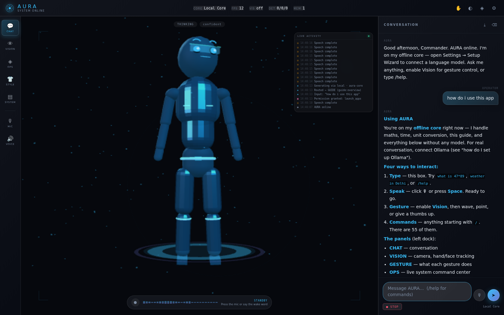
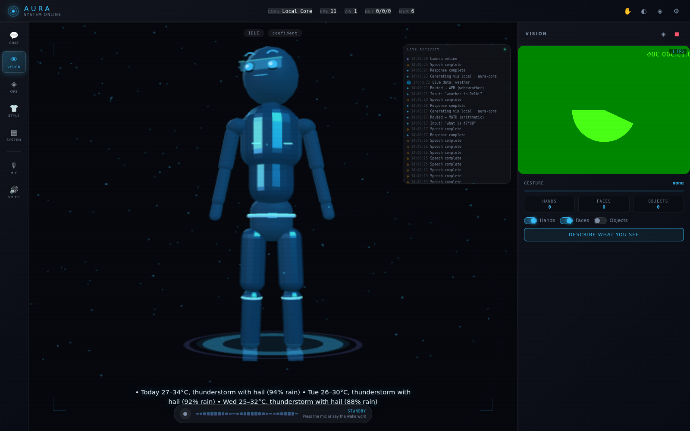
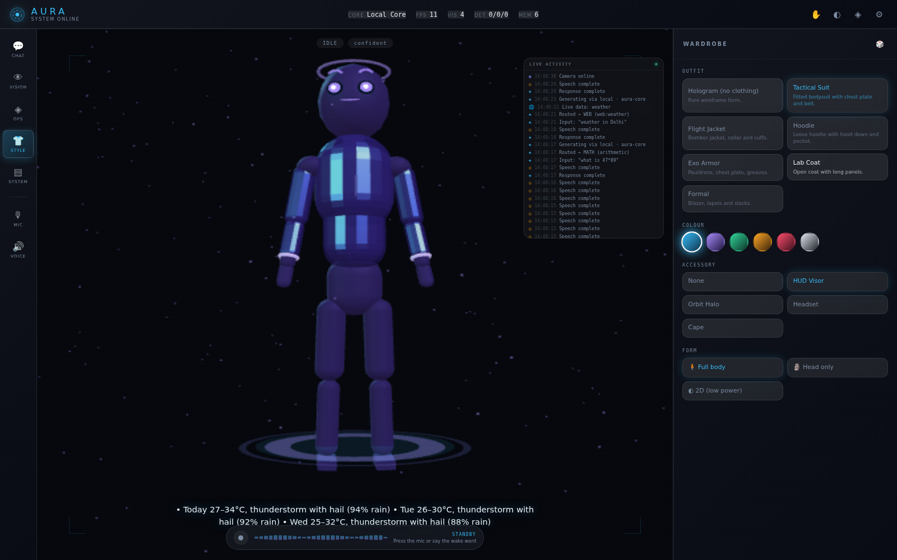
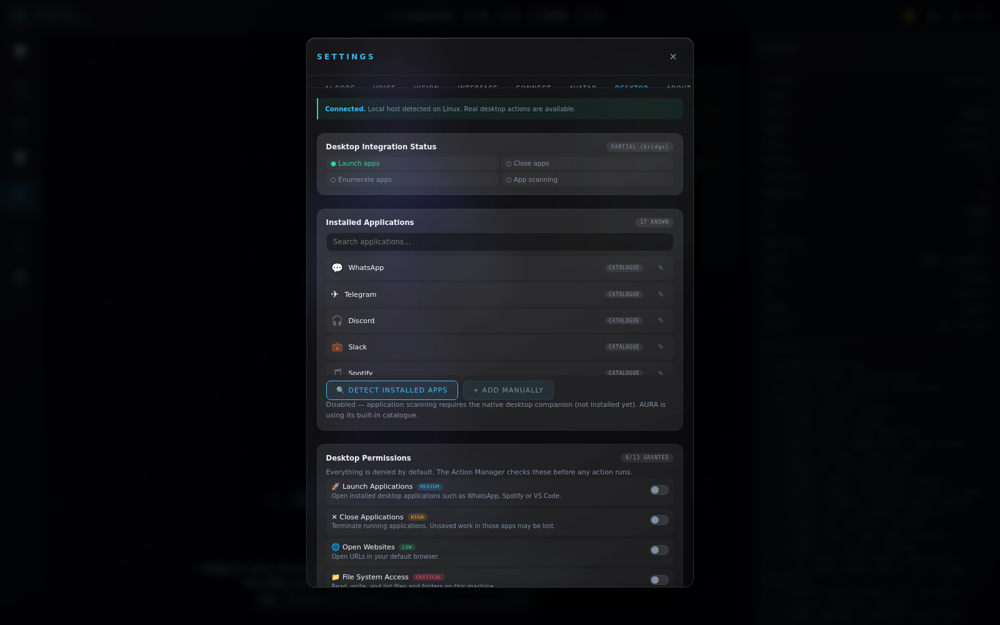

# AURA

**Adaptive Unified Response Assistant** — a holographic AI operating system that runs entirely in your browser. Voice, webcam vision, hand-gesture control, desktop automation, and a full-body animated avatar.

No build step. No backend. No `npm install` required to run.



---

## Quick start (Windows)

```powershell
# 1. Get a model running (one time)
#    Download Ollama from https://ollama.com/download
ollama pull gemma2:2b

# 2. Start AURA
cd aura
python serve.py --allow-actions
```

Opens `http://localhost:8000` automatically. That's it — Ollama is detected on its own.

> **Do not open `index.html` directly.** Browsers block camera, microphone, and ES modules on `file://`. The server exists purely to provide a secure context (`localhost`), which browsers trust.

### Server flags

| Flag | Effect |
|---|---|
| *(none)* | Chat, vision, voice, avatar |
| `--allow-actions` | **+ desktop control** (open apps, media, volume, screenshots) |
| `--allow-lan` | Also serve on your LAN, for phone testing |
| `--ollama URL` | Non-default Ollama address |
| `8080` | Any bare number sets the port |

### Requirements

| | |
|---|---|
| **Python** | 3.8+ (standard library only; `psutil` optional, for real CPU/RAM readings) |
| **Browser** | Chrome or Edge recommended — Firefox has no Web Speech API |
| **Ollama** | Optional but recommended. Without it, an honest offline core runs |
| **Disk** | ~50 MB (44 MB of that is vendored AI models) |

```powershell
pip install psutil   # optional: enables live CPU/RAM in the System Monitor
```

---

## Where the AI comes from

AURA ships **no model of its own**. It is a client that connects to a brain you provide.

| Source | Setup | Privacy |
|---|---|---|
| **Ollama** *(recommended)* | `ollama pull gemma2:2b` | 100% local |
| **API key** | Settings → AI Core | Text goes to that provider |
| **Offline core** | None — always available | 100% local |

The **offline core** is real logic, not a stub: a recursive-descent maths parser, unit conversion, date reasoning, conversation memory, webcam scene description, and the built-in guide. It is honest about what it doesn't know rather than inventing answers.

### Ollama needs no CORS configuration

The page runs on `:8000`; Ollama listens on `:11434`. That's a different origin, so a direct browser fetch triggers a CORS preflight a stock Ollama rejects — the usual reason browser apps can't reach it.

AURA proxies Ollama through its own server at `/api/ollama/*`, making it same-origin. **You do not need `OLLAMA_ORIGINS`.**

### Model discovery — Ollama is the only source of truth

AURA never assumes which models you have. On startup, and whenever you open
Settings → AI Core, it calls `/api/tags` — the same thing `ollama list` prints —
and uses those exact strings.

* No model name is baked into the app. `ollama.defaultModel` is `null` until discovery runs.
* If a configured model isn't installed, AURA **snaps to a real one and tells you**
  (`"gemma2" → "gemma2:2b"`), rather than sending a name Ollama will reject.
* This is enforced three times: in the UI, in the provider adapter, and again in
  `serve.py` — so a bad name physically cannot reach Ollama.
* Install suggestions appear **only** when you have zero models, and never affect routing.

To see exactly what AURA can see:

```
ollama list                          # what you have
curl http://localhost:11434/api/tags # what AURA reads
```

### Model routing

AURA reads your installed models and routes per task. **No model names are hardcoded** — capability is inferred from name and size.

```
⚡ gemma2:2b          2.6B  instant   → chat
🟢 qwen2.5-coder:7b   7.6B  fast      → code, tools
🟢 deepseek-r1:8b     8.0B  fast      → reasoning
🔴 qwen3:30b-a3b     30.5B  excluded — above the 9B auto ceiling
```

Models above **9B are never auto-selected**, because a 20B+ model can take minutes per reply on typical hardware. They stay usable — pin them deliberately:

```
/pin code qwen2.5-coder:14b     # warns it's above the ceiling, then obeys
/models                          # see everything and its routing
```

AURA also measures real throughput per model and demotes whatever turns out slow on *your* machine.

---

## Using it

### Talk
Type, or press 🎙 / **Space**. AURA replies in text and voice, speaking each sentence as it streams.

While answering: **STOP** aborts for real · **CONTINUE** resumes · **REGENERATE** retries · **INTERRUPT** silences.

### Gestures
**VISION → ENABLE CAMERA**, then hold a pose:

| | Gesture | Action |
|---|---|---|
| 👋 | Wave | Greets you aloud |
| 🖐 | Open palm | Starts listening |
| 👍 | Thumbs up | Confirms a pending action |
| 👎 | Thumbs down | Cancels / stops |
| ✌ | Peace | Opens chat |
| ☝ | Point | Reticle tracks your fingertip |
| ✊ | Fist | Hard stop |
| 👌 | OK | Systems check |
| 🤘 | Rock on | Toggles music |

### Desktop control
With `--allow-actions` and permissions granted in Settings → Desktop:

```
open whatsapp        play music          volume 40
open spotify         next song           take a screenshot
```

**Security:** bound to `127.0.0.1` · random token per launch · fixed 18-app allowlist · `shell=False` (no command injection) · every action logged. Verified against injection, `file://`, SSRF, and oversized payloads.

### Commands
`/help` lists all **55**. Highlights:

```
/guide          built-in manual (works with no model)
/models         installed models + task routing
/runtime        layer, hardware, and service status
/why <text>     explain how AURA would route something
/weather /news /crypto /fx /wiki /define /repo
/open /apps /media /volume /screen
/remember /recall /learn /forget
/offline on     disable ALL internet lookups
```

### Shortcuts
`Enter` send · `Shift+Enter` newline · `Space` mic · `Esc` stop · `M` mute · `T` theme · `,` settings

---

## Screenshots

| | |
|---|---|
|  |  |
| Built-in guide (no model needed) | Vision + hand tracking |
|  |  |
| Full-body avatar + wardrobe | Desktop permissions |

---

## Privacy

**Never leaves your machine:** camera frames, microphone audio, API keys, conversation memory, preferences, stored knowledge.

**Leaves only if you choose it:** chat text to a cloud provider (not with Ollama or the offline core) · live-data lookups (`/offline on` disables all of them).

⚠️ **One exception:** Chrome's Web Speech API sends audio to Google's servers. That's the browser's implementation, not AURA's — there is no local speech recognition available in-browser.

AURA has no backend of its own and no telemetry.

---

## Documentation

| File | Contents |
|---|---|
| **[DEVELOPER_GUIDE.md](DEVELOPER_GUIDE.md)** | **Start here for local development** |
| [ARCHITECTURE.md](ARCHITECTURE.md) | Layered design, event flow, AI pipeline |
| [DESKTOP_ARCHITECTURE.md](DESKTOP_ARCHITECTURE.md) | Action manager, permissions, plugins |
| [MODELS.md](MODELS.md) | Model routing and the built-in guide |
| [DESKTOP_CONTROL.md](DESKTOP_CONTROL.md) | **Screen, mouse & keyboard setup** — start here for automation |
| [UI_COMMAND_CENTER.md](UI_COMMAND_CENTER.md) | Command center panels and data sources |
| [DEPLOY.md](DEPLOY.md) | Hosting options and trade-offs |
| [FEATURE_STATUS.md](FEATURE_STATUS.md) | Per-feature status with evidence |

## Tests

```bash
./tests/run-all.sh          # everything
node tests/test-core.mjs    # no browser needed
```

**2685 assertions**, 0 failures, 0 console errors, 0 TypeScript errors.

| Suite | Assertions | Needs |
|---|---|---|
| `test-core` · `test-desktop` · `test-router` · `test-models` | 440 | node only |
| `test-providers` · `test-actions` · `test-live` · `test-architecture` | 92 | node only |
| `test-voice-loop` | 16 | node only — voice feedback-loop guards |
| `test-gesture-wave` | 15 | node only — wave-back + memory-growth guards |
| `test-desktop-tools` | 37 | node only — custom apps + AI fallback safety |
| `test-bridge-security` | 29 | terminal/filesystem security contract |
| `test-new-features` | 24 | playwright — new UI end-to-end |
| `test-theming-memory` | 44 | playwright — appearance, memory, merge, springs |
| `test-vrm-mtoon` | 29 | playwright — real VRM 1.0 / 0.x, MToon, spring bones |
| `test-server-resilience` | 18 | abandoned connections + request-loop guards |
| `test-server-concurrency` | 8 | starts a real server + slow fake Ollama |
| `test-ollama-live` | 10 | real browser end-to-end against a fake Ollama |
| `browser-test` · `test-integration` · `test-command-center` · `test-guide` · `test-desktop-ui` · `test-body` | 252 | playwright |

## Optional extras

AURA runs with **none** of these — `serve.py` needs only the standard library.
Each unlocks one capability, and AURA says plainly when one is missing.

```bash
pip install -r requirements.txt      # everything
# or pick and choose:
pip install psutil                   # real CPU/RAM in the System Center
pip install ddgs trafilatura         # web research (search + read pages)
pip install pyautogui                # input automation (mouse + keyboard)
```

### Web research
`/search how do transformers work` → DuckDuckGo (no API key) → reads the top
pages → your local Ollama model answers with `[1]`-style citations.
Depth is adaptive: quick factual lookups use snippets, explanatory questions
read the sources. Configure under **Settings → Desktop → Web Research**.

### Face recognition
**Settings → Vision → Face recognition.** Enrol someone by name and AURA
greets them when they appear. Built from the 478 face landmarks it already
computes, so there is no extra download and it works offline. It stores a
short array of numbers per person — **never an image** — in this browser only.
Good for a household; it is not a security mechanism.

### Image understanding
`/look` sends the current camera frame to a multimodal model so it genuinely
**sees** the picture, rather than reading AURA's text description of it.

```
ollama pull moondream      # 1.7 GB, fast
ollama pull llava:7b       # 4.7 GB, better
```

Then turn the camera on and try `/look what am I holding`. Without a vision
model installed AURA says so and names one to pull.

### Semantic memory
When an embedding model is present, the knowledge store searches by **meaning**
rather than keywords — "how do I make the assistant faster" finds a note about
"reducing model latency".

```
ollama pull nomic-embed-text     # 270 MB
```

Without one it falls back to keyword search and reports which backend is
actually in use.

### Input automation
**Settings → Desktop → Input Automation.** Off until you arm it. Every plan is
described in plain English before it runs, dangerous key combinations are
permanently blocked, and **slamming the mouse into the top-left corner aborts
anything instantly**.

## Troubleshooting

**Windows: `UnicodeEncodeError: 'charmap' codec can't encode characters`**

Fixed. Windows consoles default to cp1252, which cannot print the banner's
box-drawing characters, and the server died before it started. AURA now
detects this and falls back to ASCII. If you are running an older copy, either
pull this version or run:

```powershell
set PYTHONIOENCODING=utf-8
python serve.py --allow-actions
```

**Windows: `ConnectionAbortedError [WinError 10053]` traceback**

Harmless and now silenced. It happened when the browser closed a connection
mid-response (a tab reload during an in-flight request). The server was never
actually crashing, but it printed a full traceback that looked like one.

**Console spammed with `ACTION get_policy`**

Fixed. Rendering the Desktop pane fetched the terminal policy, and fetching it
counted as an action, which re-triggered the render. The policy is cached now.

**AURA replies to its own voice**

Fixed. The microphone is now hard-muted the instant speech starts (with a
900 ms tail afterwards), and late results that Chrome buffers before
`stop()` completes are discarded. If it still happens on a very loud
speakerphone setup, turn off *Settings -> VOICE -> Auto-send on final*, or use
headphones.

**"Cannot reach Ollama … (Failed to fetch)" while Ollama is clearly running**

This was a real AURA bug, fixed. `serve.py` was single-threaded, so one chat
request blocked every other request — including the status probe — until the
browser timed out. If you still see it:

```bash
curl http://localhost:11434/api/tags      # is Ollama itself up?
curl http://localhost:8000/api/ollama/status   # can AURA see it?
```
If the first works and the second doesn't, restart AURA — you may be running an
old `serve.py`. You do **not** need to set `OLLAMA_ORIGINS`.

**AURA used a model I don't have / spelled the name wrong**

Fixed — no model names are hardcoded any more. AURA reads `/api/tags` and, if a
configured name isn't installed, substitutes a real one and says so. Clear a
stale pin with `Settings → CONNECT → Local model for quick replies` (leave it
blank for auto), or `/pin <task> none`.

**AURA hears itself and talks in a loop**

Fixed. The mic is now closed while AURA speaks and reopened afterwards, plus
transcripts matching what it just said are discarded. If you still get echo on a
speakerphone-style setup, turn off `Settings → VOICE → Auto-send on final`, or
use headphones.

**The mic gets stuck on "LISTENING"**

Recognition restarts are now backed off and stop after 6 rapid failures with an
explanation. Check the microphone is connected and allowed in the address bar.

## Known limitations

Stated plainly, all verified:

> Recently closed: web search, face recognition, input automation, image
> understanding and semantic memory are all implemented — see
> `FEATURE_STATUS.md`. What follows is what genuinely still does not work.

1. **Firefox has no speech recognition** — AURA detects this and explains rather than showing a dead button.
2. **Camera/mic need `localhost` or `https`** — `file://` never works.
3. **WebXR AR is unverified** — implemented with hit-testing, but I had no XR device. A camera-passthrough fallback is used elsewhere, labelled *SIMULATED AR*.
4. **Listening waveform amplitude is animated, not measured** — browsers don't expose mic levels without an AnalyserNode. The *speaking* waveform is real.
5. ~~No true web search~~ — **now implemented.** `pip install ddgs trafilatura`
   and AURA searches, reads the pages, and reasons over them locally.
6. **The native desktop companion is not built** — app scanning, file system, terminal, and input automation are architecture-only, marked `TODO(windows)`.
